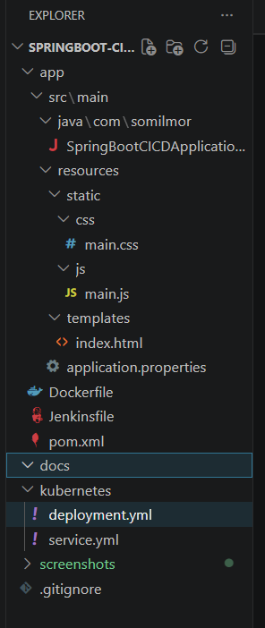
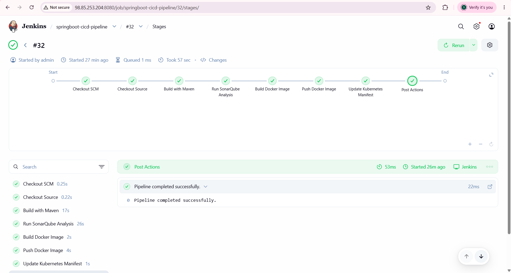
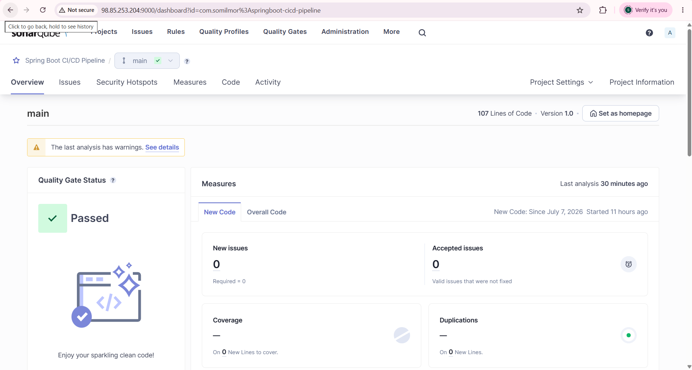
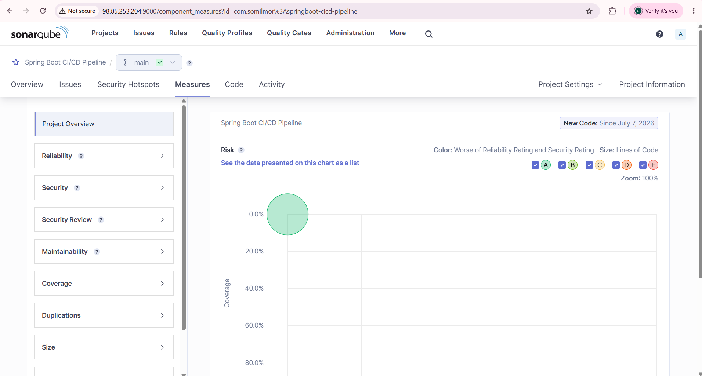
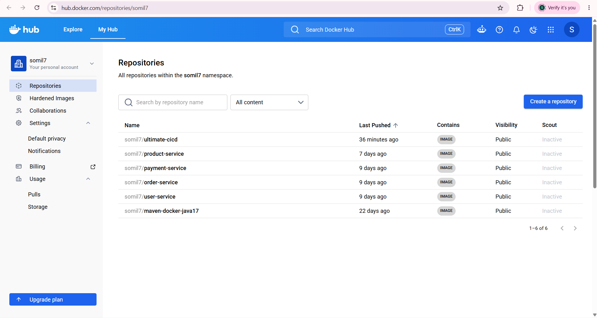
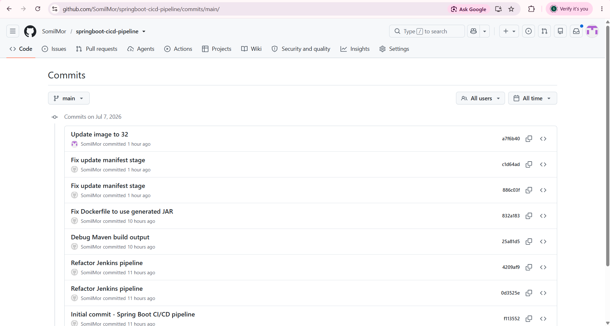
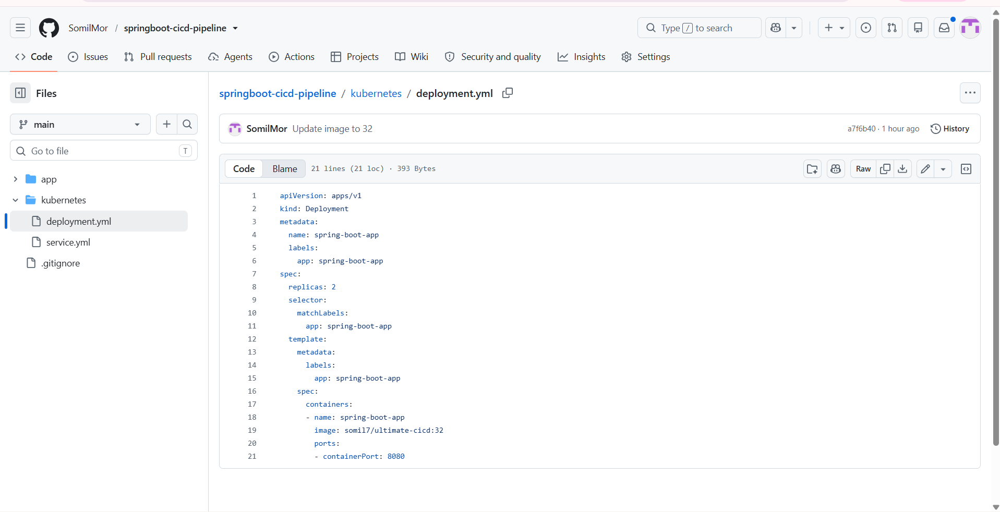
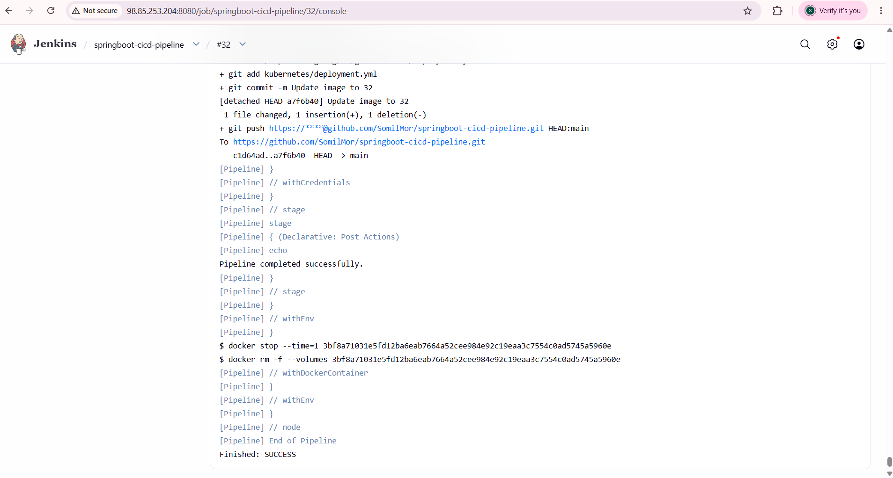

# 🚀 Spring Boot CI/CD Pipeline using Jenkins, SonarQube, Docker & Kubernetes

A complete **CI/CD pipeline** for a Spring Boot application demonstrating automated build, code quality analysis, Docker image creation, Docker Hub integration, and GitOps-based Kubernetes deployment manifest updates using Jenkins.

---

## 📖 Project Overview

This project demonstrates how a modern DevOps CI/CD pipeline can automate the complete software delivery lifecycle.

Whenever code is pushed to GitHub, Jenkins automatically:

- ✅ Checks out the latest source code
- ✅ Builds the application using Maven
- ✅ Performs static code analysis using SonarQube
- ✅ Builds a Docker image
- ✅ Pushes the Docker image to Docker Hub
- ✅ Updates the Kubernetes deployment manifest with the latest image tag
- ✅ Pushes the updated manifest back to GitHub automatically (GitOps approach)

---

# 🏗 CI/CD Architecture

```text
                    +----------------+
                    |     GitHub     |
                    +--------+-------+
                             |
                             |
                             ▼
                    +----------------+
                    |    Jenkins     |
                    +--------+-------+
                             |
         ------------------------------------------
         |          |          |          |        |
         ▼          ▼          ▼          ▼        ▼
    Maven Build  SonarQube  Docker   DockerHub  GitOps
                   Analysis    Build     Push     Update
                                                  |
                                                  ▼
                                      Kubernetes deployment.yml
                                                  |
                                                  ▼
                                             GitHub Repository
```

---

# ⚙️ Tech Stack

| Category | Technology |
|-----------|------------|
| Language | Java 17 |
| Framework | Spring Boot |
| Build Tool | Maven |
| CI Server | Jenkins |
| Code Quality | SonarQube |
| Containerization | Docker |
| Container Registry | Docker Hub |
| Version Control | Git & GitHub |
| Orchestration | Kubernetes |
| Operating System | Ubuntu (AWS EC2) |

---

# 📂 Project Structure

```text
springboot-cicd-pipeline
│
├── app
│   ├── src
│   │   └── main
│   │       ├── java
│   │       └── resources
│   │
│   ├── Dockerfile
│   ├── Jenkinsfile
│   └── pom.xml
│
├── kubernetes
│   ├── deployment.yml
│   └── service.yml
│
├── screenshots
│
└── README.md
```

---

# 🔄 Jenkins Pipeline Workflow

## 1️⃣ Checkout Source

Jenkins clones the latest version of the application from GitHub.

---

## 2️⃣ Maven Build

The application is compiled and packaged into a runnable Spring Boot JAR.

```bash
mvn clean package
```

---

## 3️⃣ SonarQube Analysis

Static code analysis is performed to identify:

- Bugs
- Vulnerabilities
- Code smells
- Maintainability issues

```bash
mvn sonar:sonar
```

---

## 4️⃣ Docker Image Build

The generated JAR file is packaged into a Docker image.

```bash
docker build -t somil7/ultimate-cicd:${BUILD_NUMBER} .
```

---

## 5️⃣ Push Image to Docker Hub

The Docker image is automatically pushed to Docker Hub.

```bash
docker push somil7/ultimate-cicd:${BUILD_NUMBER}
```

---

## 6️⃣ Update Kubernetes Manifest

The pipeline automatically replaces the placeholder image tag inside:

```text
kubernetes/deployment.yml
```

Example:

Before

```yaml
image: somil7/ultimate-cicd:replaceImageTag
```

After

```yaml
image: somil7/ultimate-cicd:32
```

---

## 7️⃣ GitOps Commit

The updated deployment manifest is automatically committed and pushed back to GitHub.

---

# 📸 Project Screenshots

## 📁 Project Structure



---

## ✅ Jenkins Pipeline Success



---

## 🟢 SonarQube Quality Gate



---

## 🔍 SonarQube Code Analysis



---

## 🐳 Docker Hub Repository



---

## 🔄 GitHub Automatic Manifest Update



---

## ☸ Kubernetes Deployment Manifest



---

## 📜 Jenkins Console Output



---

# 📦 Docker Image

Repository

```text
somil7/ultimate-cicd
```

---

# ☸ Kubernetes Deployment

Deployment manifest:

```text
kubernetes/deployment.yml
```

Service manifest:

```text
kubernetes/service.yml
```

---

# 🚀 Features

- Automated CI/CD Pipeline
- Maven Build Automation
- SonarQube Static Code Analysis
- Docker Image Creation
- Docker Hub Integration
- GitOps Manifest Update
- Kubernetes Deployment Configuration
- Jenkins Credentials Management
- Automated Versioning using Jenkins Build Number

---

# 📈 Pipeline Outcome

✔ Source Code Checkout

✔ Maven Build

✔ SonarQube Analysis

✔ Docker Image Build

✔ Docker Image Push

✔ Kubernetes Manifest Update

✔ GitHub Auto Commit

✔ Successful Jenkins Pipeline Execution

---

# 🔮 Future Improvements

- Deploy to Amazon EKS
- GitOps using ArgoCD
- Helm Charts
- Prometheus Monitoring
- Grafana Dashboards
- Trivy Image Scanning
- OWASP Dependency Check
- Slack Notifications
- Automated Kubernetes Deployment

---

# 👨‍💻 Author

**Somil Mor**

GitHub: https://github.com/SomilMor

---

## ⭐ If you found this project helpful, consider giving it a star!